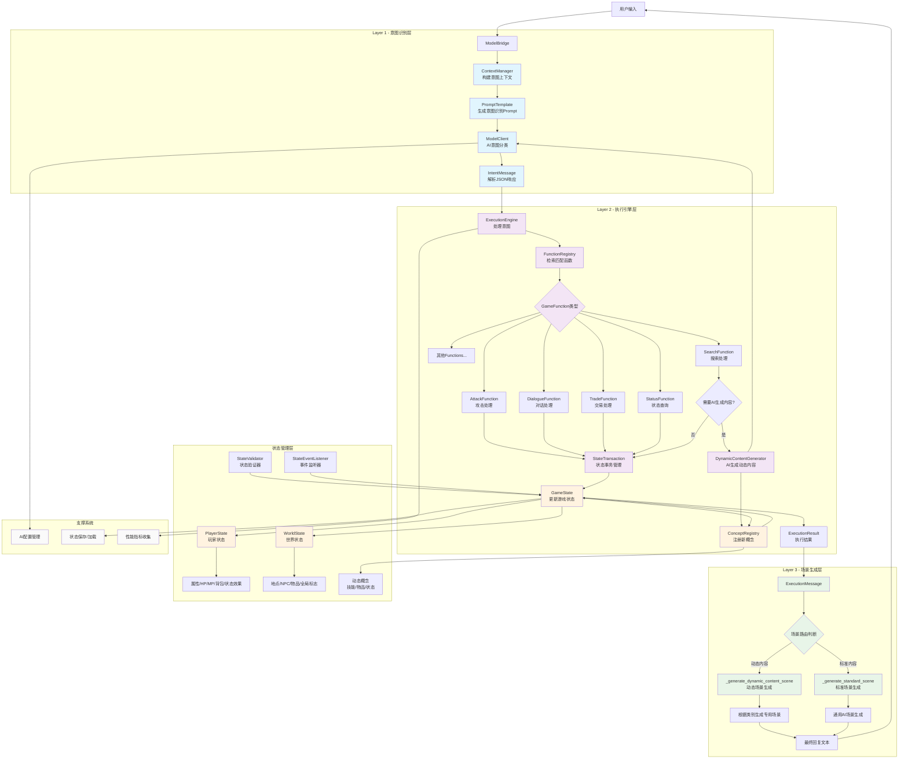

# TRPG状态管理架构设计文档

## 概述

本文档详细描述了TRPG AI Agent系统的状态管理架构设计，基于三层AI架构和动态概念管理的核心理念，实现了完全动态的游戏状态管理系统。

## 核心设计理念

### 1. 三层AI架构
- **Layer 1 (Intent Classification)**: AI意图识别层 - 理解用户意图
- **Layer 2 (Execution Engine)**: 规则执行引擎层 - 执行游戏逻辑
- **Layer 3 (Scene Generation)**: AI场景生成层 - 生成沉浸式描述

### 2. 动态概念管理
- 完全移除硬编码内容列表
- AI动态生成游戏概念(物品、技能、状态效果等)
- 概念注册表统一管理所有动态创建的概念
- 支持运行时概念创建和状态同步

### 3. 事务性状态管理
- 状态变更的原子性保证
- 支持状态回滚和验证
- 响应式状态事件处理

## 系统架构图



## 关键组件说明

### Layer 1 - 意图识别层

#### ModelBridge (`Agent/implementations/model_bridge.py`)
- **职责**: 协调三层架构的核心控制器
- **方法**: 
  - `process_user_input()`: 完整流程处理
  - `classify_intent()`: 意图识别
  - `execute_intent()`: 意图执行
  - `generate_scene()`: 场景生成

#### ContextManager (`Agent/implementations/model_bridge.py:20-70`)
- **职责**: 构建各层间传递的上下文信息
- **方法**:
  - `build_intent_context()`: 构建意图识别上下文
  - `build_execution_context()`: 构建执行引擎上下文
  - `build_scene_context()`: 构建场景生成上下文

#### PromptTemplate (`Agent/implementations/model_bridge.py:72-206`)
- **职责**: 管理AI模型的Prompt模板
- **方法**:
  - `get_intent_recognition_prompt()`: 意图识别Prompt
  - `get_scene_generation_prompt()`: 场景生成Prompt

### Layer 2 - 执行引擎层

#### ExecutionEngine (`Agent/implementations/execution_engine.py`)
- **职责**: 处理意图并执行相应的游戏逻辑
- **方法**:
  - `process()`: 处理意图并返回执行结果
  - `register_function()`: 注册新的GameFunction
  - `get_supported_categories()`: 获取支持的意图分类

#### FunctionRegistry (`Agent/implementations/execution_engine.py:20-68`)
- **职责**: 管理所有可用的GameFunction
- **方法**:
  - `register()`: 注册Function
  - `find_functions_by_intent()`: 根据意图检索Function
  - `get_function_by_name()`: 获取指定Function

#### GameFunction基类 (`Agent/interfaces/execution_interfaces.py:13-84`)
- **AttackFunction**: 攻击处理 (`Agent/implementations/execution_engine.py:207-249`)
- **SearchFunction**: 搜索处理 (`Agent/implementations/execution_engine.py:250-292`)
- **DialogueFunction**: 对话处理 (`Agent/implementations/execution_engine.py:293-335`)
- **TradeFunction**: 交易处理 (`Agent/implementations/execution_engine.py:336-378`)
- **StatusFunction**: 状态查询处理 (`Agent/implementations/execution_engine.py:379-421`)

#### DynamicContentGenerator (`Agent/implementations/dynamic_content_generator.py`)
- **职责**: 使用AI生成动态游戏内容
- **方法**:
  - `generate_search_result()`: 生成搜索结果
  - `generate_npc_dialogue()`: 生成NPC对话
  - `_register_discovered_item()`: 注册发现的物品

### Layer 3 - 场景生成层

#### 场景路由判断 (`Agent/implementations/model_bridge.py:322-341`)
- 根据执行结果决定使用动态内容生成还是标准场景生成

#### 动态场景生成 (`Agent/implementations/model_bridge.py:343-391`)
- 处理搜索、对话、交易、状态查询等需要特殊处理的场景

#### 标准场景生成 (`Agent/implementations/model_bridge.py:393-406`)
- 使用AI模型生成通用的场景描述

### 状态管理层

#### GameState (`Agent/implementations/game_state.py`)
- **职责**: 游戏状态的顶层接口
- **组成**:
  - `player`: PlayerState - 玩家状态
  - `world`: WorldState - 世界状态
  - `concepts`: ConceptRegistry - 概念注册表

#### PlayerState (`Agent/implementations/game_state.py:44-148`)
- **属性**: HP/MP/属性值/背包/状态效果/位置
- **方法**: 状态获取/设置/物品管理/状态效果管理

#### WorldState (`Agent/implementations/game_state.py:150-245`)
- **内容**: 地点/NPC/全局标志/地点物品
- **方法**: 地点管理/NPC管理/物品管理

#### ConceptRegistry (`Agent/implementations/game_state.py:247-340`)
- **职责**: 管理动态创建的游戏概念
- **方法**: 概念创建/获取/更新/删除/搜索

## 状态创建流程详解

根据`docs/status.md`的要求，状态创建分为两大类型：

### 1. 执行类状态创建流程

```
用户输入 → 意图识别 → 函数检索 → 执行并修改状态 → 结果展示
                                           ↓
                              同步发送至AI模型 → 生成描述文本
```

**实现路径**:
1. `ModelBridge.classify_intent()` - 识别用户意图
2. `ExecutionEngine.process()` - 检索并执行相应Function
3. `GameFunction.execute()` - 执行具体逻辑并修改状态
4. `GameState.apply_change()` - 应用状态变更
5. `ModelBridge.generate_scene()` - 生成场景描述

### 2. 动态概念创建流程

```
AI回复/用户提及新概念 → 概念识别 → 创建概念实体 → 写入概念注册表 → 状态同步
                                              ↓
                                    更新相关状态表(技能表/状态表/物品表)
```

**实现路径**:
1. `DynamicContentGenerator.generate_search_result()` - AI生成新概念
2. `DynamicContentGenerator._register_discovered_item()` - 识别新概念
3. `ConceptRegistry.create_concept()` - 创建概念实体
4. `GameState.apply_change()` - 同步状态变更
5. 概念持久化到概念注册表中

## 用户输入分类处理

### 1. 执行动作类
- **意图**: 攻击、使用技能、使用物品、拾取、盗窃开锁等
- **处理**: 严格的状态验证 → 执行检定 → 状态修改 → AI描述
- **文件**: `AttackFunction`、各种GameFunction

### 2. 查询类  
- **意图**: 向DM询问环境、人物情况等
- **处理**: 难度评估 → 骰子检定 → 结果生成
- **实现**: 通过metadata控制AI生成难度

### 3. 探索与对话类
- **意图**: 与NPC对话、移动到新地点
- **处理**: 直接查询状态 → 生成回复
- **文件**: `DialogueFunction`、动态场景生成

### 4. 推理与想象类
- **意图**: 创造性操作，超出基本规则
- **处理**: 可行性分析 → 困难度评估 → 检定执行 → 状态变更
- **实现**: 通过AI模型评估可行性和难度

## 技术特性

### 1. 动态性
- **零硬编码**: 完全移除静态内容列表
- **AI驱动**: 所有新概念由AI动态生成
- **即时注册**: 新概念立即注册到系统中

### 2. 事务性
- **StateTransaction**: 确保状态变更的原子性
- **回滚支持**: 支持失败时的状态回滚
- **验证机制**: StateValidator验证状态一致性

### 3. 扩展性
- **Function插件**: 通过注册机制轻松添加新功能
- **接口驱动**: 清晰的接口分离便于扩展
- **模块化**: 各组件职责明确，易于替换

### 4. 响应性
- **事件监听**: StateEventListener支持状态变更响应
- **实时更新**: 状态变更立即同步到相关组件
- **缓存管理**: 智能缓存提升性能

## 文件结构映射

```
Agent/
├── interfaces/                    # 接口定义层
│   ├── communication_interfaces.py # 模型间通信接口
│   ├── execution_interfaces.py     # 执行引擎接口  
│   ├── state_interfaces.py         # 状态管理接口
│   └── data_structures.py         # 核心数据结构
├── implementations/               # 实现层
│   ├── model_bridge.py           # ModelBridge实现
│   ├── execution_engine.py       # ExecutionEngine实现
│   ├── game_state.py             # 状态管理实现
│   └── dynamic_content_generator.py # 动态内容生成
└── client/
    └── model_client.py           # AI客户端
```

## 设计优势

1. **完全动态**: AI驱动的内容生成，无需预定义内容
2. **高度可扩展**: 基于接口的模块化设计
3. **状态一致性**: 事务性状态管理确保数据完整性  
4. **性能优化**: 智能缓存和异步处理支持
5. **错误处理**: 完善的错误处理和回滚机制
6. **符合TRPG规则**: 完全实现status.md中定义的状态管理流程

## 总结

这个架构成功实现了真正动态的TRPG系统，其中AI不仅负责对话生成，还深度参与到游戏状态的创建和管理中。通过三层架构的清晰分离和动态概念管理，系统能够在运行时动态创建新的游戏概念，并保持状态的一致性和完整性。

该设计完全符合`docs/status.md`中描述的状态管理需求，实现了执行类和创建类两种状态管理流程，为TRPG游戏提供了灵活、动态、可扩展的技术基础。